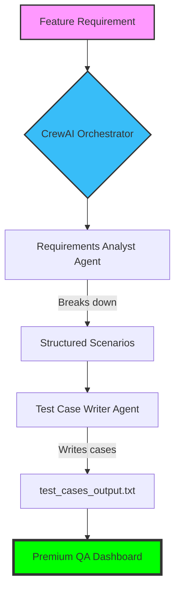

# 🚀 AI Test Case Generator using CrewAI

A high-performance, agentic workflow that transforms product feature requirements into structured, testable scenarios and detailed test cases using **CrewAI** and **Groq**.

## 📊 Workflow Architecture



## ✨ Key Features

- **Multi-Agent Orchestration**: Collaborative workflow between a Requirements Analyst and a Test Case Writer.
- **Structured Scenarios**: Automated generation of Positive, Negative, and Edge cases.
- **Detailed Output**: Comprehensive test cases with IDs, steps, expected results, and priorities (P0–P4).
- **Premium Reporting**: A stunning glassmorphism-themed HTML dashboard for quality visualization.
- **Fast Execution**: Powered by Groq's high-speed Llama models for near-instant results.

## 🛠️ Tech Stack

- **Framework**: [CrewAI](https://crewai.com)
- **Model**: Groq (Llama-3.3-70b-versatile)
- **Language**: Python 3.12+
- **Testing**: PyTest
- **Reporting**: Custom HTML (Glassmorphism UI)

## 🏗️ Project Structure

```bash
├── crew.py                # Main application logic & CrewAI definition
├── pytest_for_crew.py     # Unit tests for crew configuration
├── .env                  # Environment variables (API Keys)
├── test_cases_output.txt  # Final generated test case output
├── premium_report.html    # Premium UI report for test results
└── pytest_report.txt      # Text-based test execution report
```

## 🚀 Getting Started

### 1. Prerequisites
- Python 3.12 or higher.
- A Groq API Key (get it from [Groq Console](https://console.groq.com/)).

### 2. Installation
Clone the repository and install dependencies:
```bash
pip install crewai python-dotenv langchain-groq litellm pytest pytest-html
```

### 3. Environment Setup
Create a `.env` file in the root directory and add your API key:
```env
GROQ_API_KEY="your_api_key_here"
```

### 4. Running the Generator
To generate test cases for the default feature (User Registration):
```bash
python crew.py
```

### 5. Running Tests
To verify the system configuration:
```bash
python -m pytest pytest_for_crew.py
```

## 📈 View Results
After running the generator, you can view the results in:
1.  **test_cases_output.txt**: Plain text list of test cases.
2.  **premium_report.html**: Open this in your browser for a premium UI visualization of the tests.

---
*Generated by Antigravity AI for karan.*
